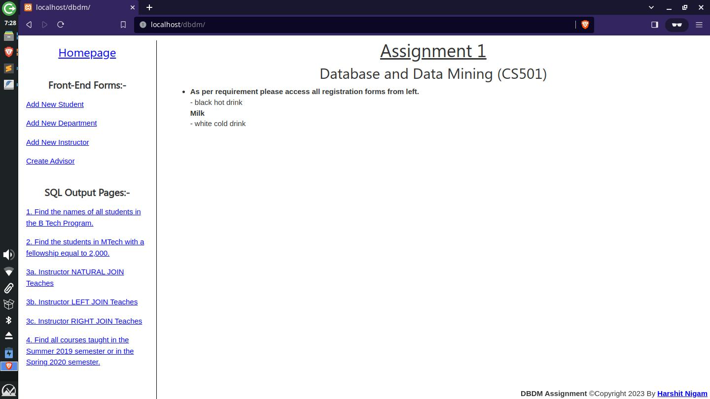

# Database and Data Mining (CS501) - Assignment 1

### Following technologies are used to develop this website:-
      • for server-side scripting PHP,
      • and for front-end HTML, CSS, JS, Jquery, AJAX.
      • MySQL as DBMS and University Database schema is based on Database 		System Concepts by Silberschatz, Korth and Sudarshan.

###  <a href="https://drive.google.com/file/d/1qtCeYBkQ6_OdeSbwM04unzFU9fKJuGY5/view?usp=sharing"> Assignment Report </a>

University Database from textbook Database System Concepts by Silberschatz, Korth and Sudarshan

